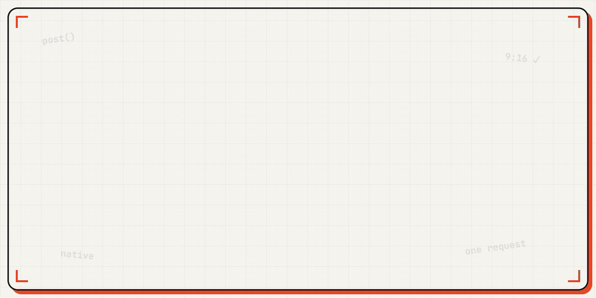

# Zernio Library Skills

<p align="center">
  
</p>


A library of Claude Code skills for [Zernio](https://zernio.com). It ships:
- **`clip-machine`** — one long video in, native TikTok + Reels + Shorts posts out. The
  four stations: CUT (word-level transcript → best-moments framework → 9:16 reframe),
  CAPTION (burned word captions + per-platform caption text), COVER (per-platform cover
  rules), POST (one Zernio request per clip). Includes the copy-paste best-moments
  selection prompt and the per-platform spec cheat-sheet (TikTok / Reels / Shorts:
  dimensions, lengths, captions, covers, native rules).
- **`zernio-publish`** — end-to-end social publishing across 13 platforms.
- **`zernio-comment-to-dm`** — build Instagram/Facebook comment-to-DM automations + DM
  sequences on command. Tell Claude a post, a keyword, and the message — it creates the
  Zernio automation and orchestrates the follow-up DMs, so you never click through a
  dashboard or clone workflows. Reuse it for any new post/keyword in seconds.
- **`meta-ads-launch`** — launch Meta (Facebook/Instagram) ad batches through Zernio's ads
  API. You decide the offer, copy, audience, and budget; Claude launches ALL your creative
  variations in one call (1 campaign + 1 ad set + N ads), then immediately pauses the
  campaign so nothing spends until you review and go live. Ships with the complete verified
  Zernio ads API reference (multi-creative shapes, idempotency, pause/resume, targeting,
  lead forms, click-to-WhatsApp). Requires the Zernio Ads add-on (included on usage-based plans).
- **`zernio-workflow-creator`** — build Zernio conversation Workflows, including a 24/7 WhatsApp
  **customer-service agent**, on command. Tell Claude what the agent should do and it builds the
  whole node graph (trigger → human-escape → AI node with memory → reply → wait → loop) via
  Zernio's Workflow API, activates it, and edits it later when you ask — no dragging nodes one by
  one. Pairs with `zernio-comment-to-dm` (comment → DM → this AI agent runs the conversation).
  Ships the full Workflow API reference (all 16 node types) + a ready, fill-in-the-blank
  customer-service agent template.
- **`zernio-voice-agent`** — give ONE WhatsApp number a full **AI front desk**: text it and an AI
  replies (memory-enabled Zernio workflow); **call it and an AI voice picks up** (Zernio WhatsApp
  Calling routes inbound calls via `forwardTo` to a **Retell AI** voice agent). Live-proven
  inbound-first: the text agent detects call intent and sends the number's tap-to-call deep link;
  the tapped call lands on the voice agent. Ships the verified calling endpoints + gates (plan +
  messaging-tier), the Retell wiring reference, the proven front-desk workflow template, an
  outbound `start_call` variant, and fill-in-the-blank voice prompts. Pairs with
  `zernio-workflow-creator`.

More Zernio skills (analytics, calendaring, account management) will land over time.

You hand Claude an asset (video file, Drive link, image folder, URL) and tell it where to post. Claude analyzes it, drafts platform-tailored captions and titles and hashtags, converts formats if needed, uploads the media, shows you the full package for approval, schedules the post via the Zernio API, verifies it landed, and logs the result.

## Install

Everything lives in one hidden folder: **`.claude/`** (note the dot — your file explorer may hide
it). Claude Code automatically discovers any skill placed at `.claude/skills/<skill-name>/` in
your project and loads it — that's the whole install mechanism.

**Option A — use this repo as your project (simplest):**

```bash
git clone https://github.com/Enriquemarq1/zernio-library-skills.git
cd zernio-library-skills
claude
```

**Option B — you already have a project (and probably your own `.claude/` folder): MERGE, don't replace.**
Your project's `.claude/` and this repo's `.claude/` are the same kind of folder. Do NOT overwrite
yours — copy the skill folders you want *into* it, side by side with your existing skills:

```bash
# from inside your project
cp -r /path/to/zernio-library-skills/.claude/skills/* .claude/skills/
```

```powershell
# Windows PowerShell
Copy-Item -Recurse \path\to\zernio-library-skills\.claude\skills\* .claude\skills\
```

Result: `your-project/.claude/skills/` now contains your own skills **plus** `zernio-publish`,
`zernio-comment-to-dm`, `meta-ads-launch`, `zernio-workflow-creator`, `zernio-voice-agent`, …

**Verify it worked:** restart Claude Code in the project and the skills appear as slash commands —
type `/` and you'll see them (e.g. `/zernio-publish`) — and they also auto-trigger when you just
describe the task ("post this video to TikTok", "make my WhatsApp answer calls with AI"). If you
don't see them, the folders are probably nested one level too deep: the check is that
`.claude/skills/zernio-publish/SKILL.md` exists at exactly that path in YOUR project.

For claude.ai web (Skills upload UI), zip the skill folder yourself:

```bash
cd .claude/skills/zernio-publish && zip -r ../../../zernio-publish.skill.zip .
```

Then upload that ZIP on claude.ai → Capabilities → Skills.

## Configure

Edit `.env` at the repo root, replace the placeholder with your real key from https://zernio.com/dashboard/api-keys, and run:

```bash
git update-index --skip-worktree .env
```

That keeps your local key edits from being staged into commits while the file stays tracked.

## Use

In Claude Code, just say what you want to ship:

> "Publish this video to my YouTube, TikTok, and Reels: `./media/launch.mp4`"
>
> "Drop a carousel post to Instagram and LinkedIn from this Drive folder: `<drive-url>`. Angle: three lessons from launching v1."

Claude reads the skill, runs through the workflow (intake → analyze → draft → convert → upload → package → approve → post → verify → log), shows you the full package, and ships on your approval.

## What's in the box

```
zernio-library-skills/
├── .claude/
│   └── skills/
│       ├── zernio-publish/                    ← the publishing skill
│       │   ├── SKILL.md
│       │   ├── reference/                       deep API + per-platform docs
│       │   └── templates/manifest.json
│       ├── zernio-comment-to-dm/              ← comment-to-DM automations + sequences
│       │   ├── SKILL.md
│       │   ├── reference/zernio-automations-api.md
│       │   └── templates/automation.json
│       ├── meta-ads-launch/                   ← Meta ad batches via Zernio's ads API
│       │   ├── SKILL.md
│       │   ├── reference/zernio-ads-api.md      the complete verified ads API reference
│       │   └── templates/campaign-plan.json
│       ├── zernio-workflow-creator/           ← Zernio Workflows + WhatsApp AI agents
│       │   ├── SKILL.md
│       │   ├── reference/zernio-workflows-api.md  full node/edge contract (16 node types)
│       │   └── templates/whatsapp-customer-service-agent.json
│       ├── zernio-voice-agent/                ← WhatsApp AI FRONT DESK (Zernio + Retell AI)
│       │   ├── SKILL.md                          text + voice on one number, inbound-first
│       │   ├── reference/whatsapp-calling-api.md  verified calling endpoints + gates + start_call
│       │   ├── reference/retell-voice-api.md      Retell wiring (inbound_agents / SIP / wss)
│       │   └── templates/
│       │       ├── whatsapp-ai-front-desk.workflow.json  THE proven graph (text + tap-to-call)
│       │       ├── whatsapp-voice-agent.workflow.json    outbound start_call variant
│       │       ├── retell-voice-agent.base.md            fill-in-the-blank voice prompt
│       │       └── retell-voice-agent.example.md         a filled voice prompt (booking)
│       └── skill-creator/                     ← Anthropic's official skill-creator
│                                                  bundled for when you add more skills
├── .env                                       ← ZERNIO_API_KEY (placeholder until you fill it)
├── CLAUDE.md                                  ← architectural map of the repo
├── README.md
├── LICENSE                                    ← MIT
└── .gitignore
```

No build scripts, no helper scripts, no auto-generated artifacts. The agent has its native Claude Code toolkit (bash, curl, ffmpeg, vision, transcript extraction, web fetching) and uses those directly.

## Adding more skills to the library

Drop a new folder under `.claude/skills/`:

```bash
mkdir .claude/skills/my-new-zernio-skill
# Create SKILL.md with YAML frontmatter (name + description) and the skill's instructions
```

The bundled `skill-creator` at `.claude/skills/skill-creator/` is Anthropic's official tool for designing and improving skills — invoke it when building a new one.

## Design principles

- **End-to-end agency.** Claude handles intake, analysis, drafting, conversion, upload, posting, verification, logging. Not transport-only.
- **The skill informs; the agent acts.** SKILL.md is reference knowledge plus a suggested workflow — not a script. The agent uses its native tools to execute.
- **Approval before publish.** Every post passes through an explicit gate. No bypass, no auto-publish.
- **Verify, don't trust.** Zernio's 200 OK ≠ landed on the platform. Claude hits each platform's public URL or oEmbed after `scheduledFor + 60s` and surfaces any field drift.
- **Schedule, don't push.** Multi-platform posts always use `scheduledFor` 2-3 minutes ahead.
